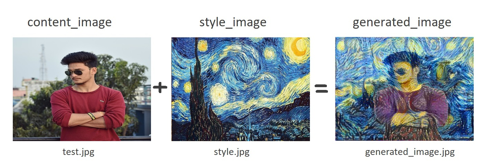

# Art Generation

Neural Style Transfer (NST) is one of the most fun techniques in deep learning. As seen below, it merges two images, namely, a "content" image (C) and a "style" image (S), to create a "generated" image (G). The generated image G combines the "content" of the image C with the "style" of image S.<br>

<p align="center"><i><b>J(G) = α * J<sub>content</sub>(C,G) + β * J<sub>style</sub>(S,G)</b></i></p>




where,<br> **α** = weight of the content image <br>
**β** = weight of the style image <br>
**J<sub>content</sub>(C,G)** = content layer cost<br>
**J<sub>style</sub>(S,G)** = style layers cost<br>


## Requirements

### Data Files

* Download [ Pre-trained VGG model ] (http://www.vlfeat.org/matconvnet/models/imagenet-vgg-verydeep-19.mat) Put it in the 
tasks/computer-vision/image-generation/art_generation/model/ directory of this repository. 
- This model contains ['input', 'conv1_1', 'conv1_2', 'avgpool1', 'conv2_1', 'conv2_2', 'avgpool2', 'conv3_1', 'conv3_2', 'conv3_3', 'conv3_4', 'avgpool3', 'conv4_1', 'conv4_2', 'conv4_3', 'conv4_4', 'avgpool4', 'conv5_1', 'conv5_2', 'conv5_3', 'conv5_4', 'avgpool5'] layers.


### Dependencies

You can install Python dependencies using `pip install -r requirements.txt`,
and it should just work. If you want to install the packages manually, here's a
list:

- tensorflow>=1.14.0
- mlflow>=1.2.0
- scipy==1.1.0
- matplotlib>=3.1.1
- pillow>=6.1.0


## Run the code

- Navigate to tasks/computer-vision/image-generation/art_generation/ directory within the repository.
- Place the images in tasks/computer-vision/image-generation/art_generation/images/ directory then issue any of the following commands:

```bash
python art_generation.py {alpha} {beta} {content_image} {style_image} {content_layer} {style_lname} {style_lcoff} {iterations}
```
**NOTE :** {style_lname} and {style_lcoff} must be same length and {style_lname} corresponding to these layers  [1_1, 1_2, 2_1, 2_2, 3_1, 3_2, 3_3, 3_4 ,4_1, 4_2, 4_3, 4_4, 5_1, 5_2, 5_3, 5_4], by combining these two arguments generates {style_layers} which help to compute the total style_layer cost.<br>
For exmaple :
```bash
python art_generation.py 10 40 /images/test.jpg /images/style.jpg 4_2 1_1,2_1,3_1,4_1,5_1 0.2,0.2,0.2,0.2,0.2 1000
```
To set only specific argument, set `-NA` to use default values for arguments and set only these specific agrument. For exapmle if you only want to set the content_layer to `5_2` and iterations to `100`:
```bash
python art_generation.py -NA -NA -NA -NA 5_2 -NA -NA 100
```

### Using mlflow

Run the code with default parameters use:
```bash
mlflow run . 
```
If requried pakages (dependencies) are pre-installed with your environment and you don't want to create a new environment:
```bash
mlflow run . --no-conda
```
You can set paramters by using different options:
```bash
mlflow run . -P alpha=10 -P beta=40 -P content_image=images/test.py -P style_image=images/style.jpg -P content_layer=4_2 -P style_lname=1_1,2_1,3_1,4_1,5_1 -P style_lcoff=0.2,0.2,0.2,0.2,0.2 -P iterations=1000
```
To set only specific parameters, for exapmle you only set the content_image to `images/test2.jpg` and style_image to `images/style2.jpg`:
```bash
mlflow run . -P content_image=images/test2.py -P style_image=images/style2.jpg
```